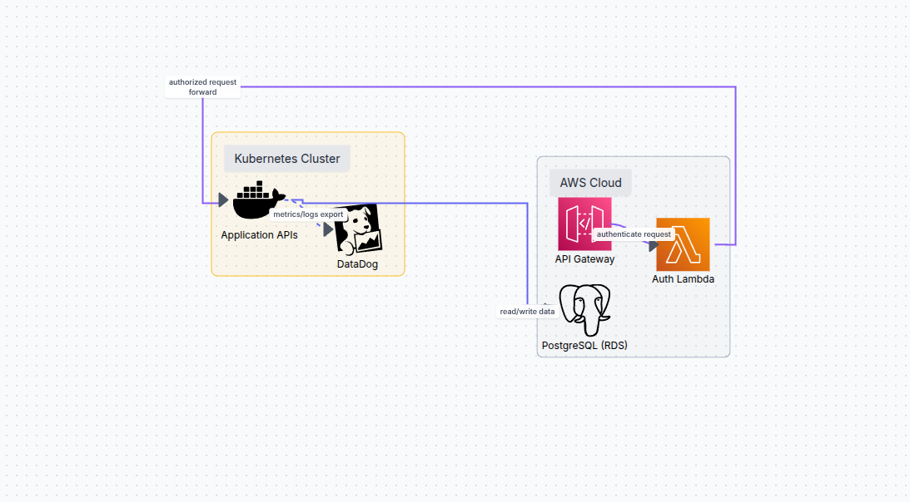

## Diagrama de Componentes

O diagrama abaixo apresenta a visão de componentes da aplicação,
incluindo AWS API Gateway, Lambda de autenticação, Kubernetes,
PostgreSQL (RDS) e monitoramento com Datadog.

